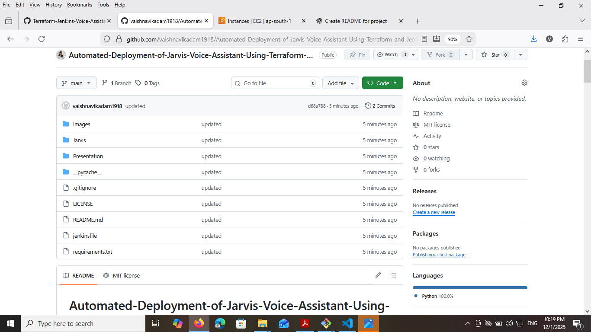

# Automated-Deployment-of-Jarvis-Voice-Assistant-Using-Terraform-and-Jenkins


---
## Overview

This README provides a complete step-by-step guide to deploying the `Jarvis` (Jarvis-Desktop-Voice-Assistant) project on an EC2 instance using Terraform and automating the deployment using Jenkins with GitHub integration.

Process includes:

1. Create EC2 instance using Terraform  
2. Install and configure Jenkins on EC2  
3. Commit Jenkinsfile to GitHub and configure GitHub → Jenkins webhook  
4. Add SSH Credentials in Jenkins  
5. Deploy using Jenkins Pipeline  

---


## 1. Creating EC2 Instance using Terraform

### File Structure
- provider.tf — AWS provider and region  
- variables.tf — Terraform variables (`ami`, `instance_type`, `key_name`, etc.)  
- main.tf — EC2 instance + security group + key pair  
- outputs.tf — Outputs such as public IP  
- user_data.sh — Bootstrap configuration  

---

### provider.tf
```bash
provider "aws" {
  region = var.aws_region
}
```

### variables.tf
```bash
variable "aws_region" { default = "ap-south-1" }
variable "ami" {}
variable "instance_type" { default = "t2.micro" }
variable "key_name" {}
variable "allowed_cidr" { default = "0.0.0.0/0" }
```

### main.tf (Important parts)
```bash
resource "aws_key_pair" "jarvis" {
  key_name   = var.key_name
  public_key = file("~/.ssh/id_rsa.pub")
}

resource "aws_security_group" "jenkins_sg" {
  name = "jenkins_sg"

  ingress {
    from_port   = 22
    to_port     = 22
    protocol    = "tcp"
    cidr_blocks = [var.allowed_cidr]
  }

  ingress {
    from_port   = 8080
    to_port     = 8080
    protocol    = "tcp"
    cidr_blocks = [var.allowed_cidr]
  }

  egress {
    from_port   = 0
    to_port     = 0
    protocol    = "-1"
    cidr_blocks = ["0.0.0.0/0"]
  }
}

resource "aws_instance" "jarvis" {
  ami           = var.ami
  instance_type = var.instance_type
  key_name      = aws_key_pair.jarvis.key_name
  vpc_security_group_ids = [aws_security_group.jenkins_sg.id]
  user_data = file("user_data.sh")
  tags = {
    Name = "jarvis-deploy"
  }
}

output "public_ip" {
  value = aws_instance.jarvis.public_ip
}
```

---

### user_data.sh (Example)
```bash
#!/bin/bash
apt update -y
apt upgrade -y
apt install -y git python3 python3-venv python3-pip rsync curl openjdk-11-jdk

mkdir -p /home/ubuntu/jarvis
chown -R ubuntu:ubuntu /home/ubuntu/jarvis
```

---

### Terraform Deployment Commands
```bash
terraform init
terraform plan -var 'ami=ami-xxxxx' -var 'key_name=mykey'
terraform apply
```

---

## user_data.sh

### SSH into EC2
```
ssh -i key.pem ubuntu@PUBLIC_IP
```

### Install Jenkins
```
sudo apt update
sudo apt install -y openjdk-11-jdk
wget -q -O - https://pkg.jenkins.io/debian-stable/jenkins.io.key | sudo apt-key add -
sudo sh -c 'echo deb https://pkg.jenkins.io/debian-stable binary/ > /etc/apt/sources.list.d/jenkins.list'
sudo apt update
sudo apt install -y jenkins
sudo systemctl enable jenkins
sudo systemctl start jenkins
```

### Jenkins UI Access
Visit:
```
http://PUBLIC_IP:8080
```

Get initial admin password:
```
sudo cat /var/lib/jenkins/secrets/initialAdminPassword
```

---
\

## 2. Adding Jenkinsfile to GitHub + Webhook Setup

### Jenkinsfile Example


```bash
pipeline {
  agent any
  environment {
    REMOTE_USER = "ubuntu"
    REMOTE_HOST = "3.110.121.35"
    REMOTE_DIR  = "/home/ubuntu/jarvis"
    CRED_ID     = "jarvis-key"
  }

  stages {
    stage('Checkout') {
      steps {
        git branch: 'main', url: 'https://github.com/<youruser>/Jarvis-Desktop-Voice-Assistant.git'
      }
    }

    stage('Package & Transfer') {
      steps {
        sshagent(credentials: ["${CRED_ID}"]) {
          sh '''
            ssh -o StrictHostKeyChecking=no ${REMOTE_USER}@${REMOTE_HOST} "mkdir -p ${REMOTE_DIR}"
            rsync -avz --delete --exclude='.git' ./ ${REMOTE_USER}@${REMOTE_HOST}:${REMOTE_DIR}/
          '''
        }
      }
    }

    stage('Remote: Setup & Restart') {
      steps {
        sshagent(credentials: ["${CRED_ID}"]) {
          sh "ssh -o StrictHostKeyChecking=no ${REMOTE_USER}@${REMOTE_HOST} 'cd ${REMOTE_DIR} && ./setup_and_restart.sh'"
        }
      }
    }
  }
}
```

---


### GitHub Webhook Setup
GitHub → Repo Settings → Webhooks → Add  

Payload URL:
```
http://JENKINS_IP:8080/github-webhook/
```

Content Type: `application/json`  
Event: **Push**

---


## 3. Adding Credentials in Jenkins

Navigate:  
Jenkins → Credentials → Global → Add Credentials  

- Kind: SSH Username with Private Key  
- Username: ubuntu  
- Private Key: Paste your PEM  
- ID: `jarvis-key`  

---

## 4. Deployment

### Create Pipeline Job in Jenkins
- New Item → Pipeline  
- Pipeline from SCM  
- Repository: `https://github.com/you/Jarvis-Desktop-Voice-Assistant.git`  
- Branch: `main`  
- Script Path: `Jenkinsfile`  

Click **Build Now**  
Webhook triggers build on new GitHub pushes.

---


#  Final Checklist

  Task                           Status
  ------------------------------ --------
  Terraform EC2 Created          ✔️
  Jenkins Installed              ✔️
  Jenkinsfile Added              ✔️
  Webhook Connected              ✔️
  SSH Credentials Added          ✔️
  Automatic Deployment Working   ✔️

------------------------------------------------------------------------


